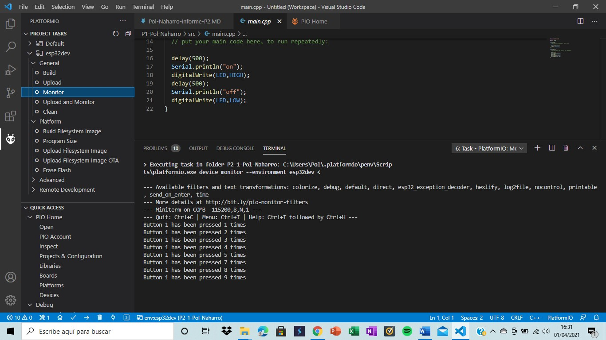

Pol Naharro
## PRACTICA 2 : INTERRUPCIONES PARTE A

##### Código Practica A: 

```
#include <Arduino.h>

struct Button {
  const uint8_t PIN;
  uint32_t numberKeyPresses;
  bool pressed;
};

Button button1 = {18, 0, false};

void IRAM_ATTR isr() {
  button1.numberKeyPresses += 1;
  button1.pressed = true;
}

void setup() {
  Serial.begin(115200);
  pinMode(button1.PIN, INPUT_PULLUP);
  attachInterrupt(button1.PIN, isr, FALLING);
}

void loop() {
  if (button1.pressed) {
      Serial.printf("Button 1 has been pressed %u times\n", button1.numberKeyPresses);
      button1.pressed = false;
  }

  //Detach Interrupt after 1 Minute
  static uint32_t lastMillis = 0;
  if (millis() - lastMillis > 60000) {
    lastMillis = millis();
    detachInterrupt(button1.PIN);
     Serial.println("Interrupt Detached!");
  }
}
```

##### Explicación:

###### Practica A: 

Esta práctica se divide en diferentes bloques el cual cada uno hace su función.

Antes de los bloques se realiza la siguiente instrucción que es para asignar al botón una pata de la placa. Button button1 = {18, 0, false};

El primer bloque es el void IRAM_ATTR isr() que consiste en un contador de las veces que el usuario ha pulsado el botón.

Después de esta el void setup() que con la instruccion Serial.begin(115200); nos da los datos por el monitor y las dos siguientes instrucciones nos conecta el botón y la otra nos ejecuta lo que pasa cuando se activa este.

El loop es un bucle que lo que hace es si el botón se pulsa este, gracias al Serial.printf("Button 1 has been pressed %u times\n", button1.numberKeyPresses); saca por pantalla el mensaje siguiente "Button 1 has been pressed %u times\n" donde %u es el número de la vez que se ha pulsado el botón. Después la instrucción se pone a "false" para que la próxima vez que se pulse vuelva a funcionar.

I el último apartado nos sirve para poner un final al código después de un minuto.

Entonces como resumen del programa vemos como el primer bloque es el contador, el segundo, el setup, se encarga de ejecutar e inicializar el botón, el tercero, el loop, lo que hace es enviar un mensaje cuando se ejecuta y el último interrumpe el contador al minuto.

##### Funcionamiento de la práctica:

###### Practica A

Comprobación interrupción:
